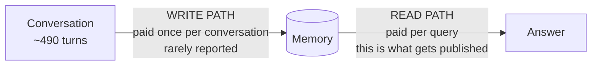
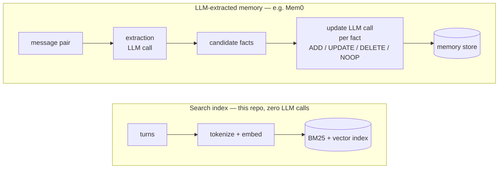
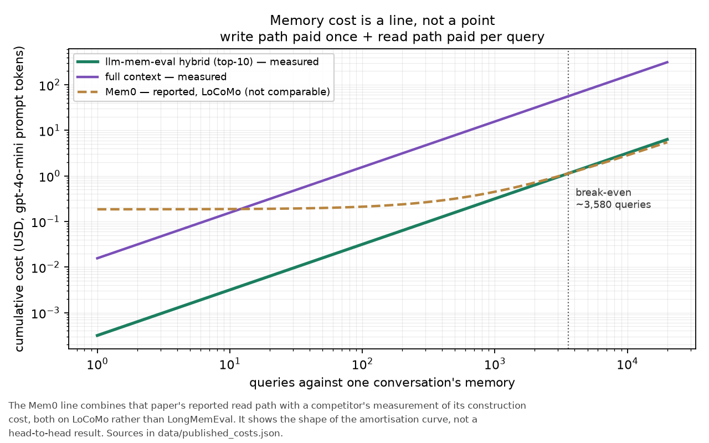
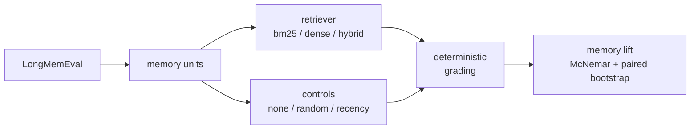

# memllm — measuring both halves of what LLM memory costs

[](https://github.com/i-shantt/memllm/actions/workflows/tests.yml)
[](LICENSE)

An evaluation harness for long-term memory systems that accounts for the cost of
**building** a memory as well as the cost of **using** it, and that measures
retrieval and answer quality without an LLM judge.

Built on [LongMemEval](https://arxiv.org/abs/2410.10813): 500 questions, each
with its own ~490-turn, ~104K-token conversation history.

**If you have five minutes:** [`memllm/cost.py`](memllm/cost.py) is the idea in
120 lines. [`memllm/eval/ablation.py`](memllm/eval/ablation.py) is the part most
likely to be useful to someone else. [`RESULTS.md`](RESULTS.md) is every table,
regenerated from run artifacts rather than typed by hand.

---

## The measurement gap

A memory system has two phases with very different economics.



The **read path** — how many tokens of retrieved context go into the prompt — is
what the field reports. Mem0's paper reports 1,764 tokens per query against
26,031 for full context ([arXiv 2504.19413](https://arxiv.org/abs/2504.19413),
Table 2). That is a real and substantial saving.

The **write path** — running an LLM over the history to extract, consolidate and
reconcile facts — is paid once per conversation, before any question is asked.
Mem0's paper does not report it. Its Section 4.5 is titled "Memory System
Overhead: Token Analysis and Construction Time", but the tokens it counts are
the *storage footprint* of the finished memory (7K per conversation), not the
tokens consumed to produce it. The only construction-cost statement in the paper
is a wall-clock one.

That is not a criticism specific to Mem0 — it is the norm. It matters because
total cost is a line, not a point:

```
total(n) = write_cost + n × read_cost_per_query
```

Reporting tokens-per-query alone is the `n → ∞` limit of that line, which
flatters whichever system spent the most up front.

This repo instruments both phases separately, so the line can be drawn.

---

## How the write cost arises

Worth being concrete, because the size of the write path follows from the
architecture.



In Mem0 as described in the 2025 paper, ingesting a message pair prompts an LLM
with a rolling conversation summary plus the last `m=10` messages and the new
pair, and that call emits a set of candidate facts. Then, *for each candidate
fact*, the top `s=10` semantically similar existing memories are retrieved and
handed back to the LLM, which picks one of **ADD**, **UPDATE**, **DELETE** or
**NOOP**. There is no separate conflict-resolution classifier — the paper is
explicit that the LLM's own reasoning plays that role. `Mem0^g` adds entity and
relationship extraction on top, into a Neo4j graph, and marks superseded
relationships invalid rather than deleting them.

Two points of accuracy:

- The paper describes that update step as a function/tool call; the open-source
  implementation in [`mem0/configs/prompts.py`](https://github.com/mem0ai/mem0/blob/main/mem0/configs/prompts.py)
  ships a JSON-returning prompt whose fourth operation is spelled `NONE`.
- **Mem0's current algorithm is not the 2025 paper's.** Their 2026
  [token-efficient memory algorithm](https://mem0.ai/blog/mem0-the-token-efficient-memory-algorithm)
  collapses ingestion into a *single-pass, ADD-only* extraction — UPDATE and
  DELETE are gone from the default path, and a superseded fact simply coexists
  with the one replacing it — with retrieval fusing semantic, keyword and entity
  matching in parallel. They report LongMemEval 94.4 at ~6,787 tokens per query.

That change matters here in two directions. It cuts the write path substantially,
since the per-fact update call disappears — though one extraction call per
message pair remains, so the write path becomes cheaper, not free. And the
retrieval it moves to, lexical and semantic signals rank-fused, is the same
family as the hybrid baseline measured below.

---

## What the cost accounting shows



Measured on LongMemEval, n=100, turn granularity, top-10 retrieved, priced at
gpt-4o-mini prompt rates:

| | write, per conversation | read, per query |
|---|---|---|
| this repo's hybrid retriever | **$0** (no LLM calls) | $0.00031 (2,097 tok) |
| full context | $0 | $0.01561 (104,059 tok) |
| Mem0 — *reported*, LoCoMo | $0.185 (1.23M tok) | $0.00026 (1,764 tok) |

Two readings, and the second is the one that matters.

**A search index with no LLM write path reads 49.6× cheaper per query than
sending the whole conversation**, and has no build cost to repay.

**Mem0's read path is genuinely cheaper per query than this repo's** — 1,764
tokens against 2,097, because extracted facts are terser than raw turns. It just
starts a build cost behind. At that rate of saving the crossover is around
**3,700 queries against a single conversation**.

That figure depends on which construction measurement you use, so all three are
shown rather than the most convenient one:

| construction source | tokens | break-even |
|---|---|---|
| RecMem Table 1, LoCoMo, gpt-4o-mini extraction | 1.23M | **~3,700 queries** |
| RecMem Table 1, LoCoMo, gpt-4.1-mini extraction | 1.52M | ~4,570 queries |
| RecMem Table 2, LongMemEval-S | 1.63M | ~4,890 queries |

The headline uses the smallest, because its extraction model matches the prices
used everywhere else here, and because quoting the largest would be picking the
number that flatters this repo.

**No memory product was re-run here.** Mem0's read path comes from its own
Table 2; the construction tokens come from
[RecMem](https://arxiv.org/abs/2605.16045), a competitor measuring it, because
Mem0 publishes no such figure. The two are also measured on *different
benchmarks* — Mem0's read path on LoCoMo, this repo's on LongMemEval — so the
comparison shows the shape of the amortisation curve, not a head-to-head result.
Every quoted figure and its source lives in
[`data/published_costs.json`](data/published_costs.json).

One same-benchmark data point does exist.
[arXiv 2606.06448](https://arxiv.org/abs/2606.06448) profiled ten memory systems
on LongMemEval_S and reports, in Table 3, LLM call counts covering construction
plus 300 QA calls: **BM25 300** (one per query, no construction), **GraphRAG
3,215**, **Mem0 4,538**, **Letta 18,394**. Its Section 4.2 is titled
"Construction Dominates the Agent Lifecycle". The same table scores Mem0 at 32.0
against BM25's 47.0 — but under a different generator (Qwen3-32B) and setup than
Mem0's own paper, so read that as evidence that tuned lexical baselines are
underrated, not as a restatement of Mem0's results.

---

## Retrieval quality

Judge-free: LongMemEval labels every turn with `has_answer`, which is a gold
*retrieval* label, so these are arithmetic. n=100, turn granularity. Full tables
in [RESULTS.md](RESULTS.md).

| system | any_hit@1 | any_hit@10 | MRR | write ms/conv | write LLM calls |
|---|---|---|---|---|---|
| random | 0.021 | 0.041 | 0.027 | 0 | 0 |
| recency (last-N turns) | 0.000 | 0.062 | 0.012 | 0 | 0 |
| **BM25** | **0.546** | 0.825 | **0.634** | **40** | **0** |
| dense (bge-small, 33M) | 0.464 | 0.897 | 0.616 | 3,020 | 0 |
| hybrid (BM25 + dense, RRF) | 0.536 | **0.907** | 0.649 | 3,075 | 0 |
| oracle (gold evidence only) | 1.000 | 1.000 | 1.000 | — | — |

Write cost is wall-clock, and wall-clock is machine-dependent. All six rows come
from one run on one machine with the embedding cache disabled
(`timing_is_authoritative: true` in the artifact), so the ratio between rows is
meaningful even though the absolute figures are not portable.

1. **BM25 beats a neural embedding model on top-1 precision and MRR** (0.546 vs
   0.464; 0.634 vs 0.616) for **75× less write cost**. The embedding model buys
   deeper recall (`any_hit@10` 0.897 vs 0.825), not better ranking.
2. **BM25 is perfect on knowledge-update questions** (`any_hit@10` = 1.000, vs
   dense 0.938) — the slice the memory-conflict literature treats as the hard one.
3. **"Just keep the last N turns" does not work.** Recency scores 0.062, barely
   above random's 0.041.

The weakest slice for BM25 is `single-session-preference` (MRR 0.158),
consistent with preference questions not being lexically similar to the turns
that answer them — but that slice is **n=6**, so treat it as a hypothesis worth
testing at full scale rather than a result.

---

## Grading without a judge

Judged scores on these benchmarks move with conventions the grader is free to
pick. [arXiv 2605.24060](https://arxiv.org/abs/2605.24060) rescored LoCoMo and
LongMemEval-S under different credited targets and found the ranking changed on
**83.4–94.0% of shared queries**, with a 1,902-case semantic audit finding
relaxed credit justified only 29.2% of the time. A metric that moves that much
with an unstated choice is a poor foundation for a cost argument.

LongMemEval mostly does not need a judge anyway. The median gold answer is **11
characters** (`Target`, `$800`, `February 14th`) — short-answer QA, which had a
reproducible metric for a decade before LLM judges existed.
[`memllm/eval/grade.py`](memllm/eval/grade.py) scores by normalised token-span
containment: no API key, no GPU for grading, byte-identical numbers on every
re-run.

Two things make that trustworthy rather than merely cheap.

**It abstains instead of guessing.** Some gold answers are rubric paragraphs
(`"The user would prefer responses that..."`) with no checkable surface form.
`grade()` returns `None` on those and they are excluded from the denominator,
which is why n=100 reports 91 graded.

**Its error rates are measured, not assumed.**
[`scripts/audit_graders.py`](scripts/audit_graders.py) builds cases whose correct
verdict is known *by construction*: take a gold answer, substitute a different
question's gold, perturb its numbers, replace it with a refusal. No annotation
needed. Over 3,166 constructed cases:

| | rate |
|---|---|
| false accept — known-wrong answers marked correct | **0.000** |
| false reject — all meaning-preserving positives | 0.001 |
| false reject — meaning-preserving *rewrites* only | **0.003** |

CI re-measures this on every push and fails the build if the false-accept rate
leaves zero, so it cannot quietly stop being true.

**Where the audit stops being enough.** Constructed negatives are *easy*
negatives. The clearest demonstration is a false accept it could not catch: on
*"Which group did I join first, 'Page Turners' or 'Marketing Professionals'?"*
(gold `Page Turners`), a model answered that it joined *Marketing Professionals*
first — and containment accepted it, because the gold string appears in the
sentence asserting the opposite. On a two-alternative question both candidates
appear in almost any answer, which makes containment nearly uninformative for
that question shape. A 0.000 false-accept rate over constructed cases is
*necessary* for trusting a grader, not *sufficient*.

Several of the grader's known defects were found by reading real model output
rather than by the audit, so the repo does both. Because every arm stores its
full per-question predictions,
[`scripts/regrade.py`](scripts/regrade.py) replays any grader change over all 23
stored arms and prints each changed verdict, and `tests/test_report.py` asserts
that re-grading an arm today still reproduces the accuracy stored with it — so
a grader change cannot silently desynchronise the results from the report.

---

## How much of the accuracy is actually memory?

A headline accuracy on its own says very little: a question answerable from world
knowledge, or one that leaks its answer in its own phrasing, is credited to the
memory system by default. So every arm was re-run against three controls at a
matched read-token budget — `none` (closed book), `random` (same `k`, units
chosen without reference to the query) and `recency` (just keep the last `k`
turns) — and scored against the **strongest** of them, since a system that beats
random but loses to "keep the last 10 turns" has demonstrated nothing.



| model | closed book | best control | hybrid | lift | 95% CI | attributable |
|---|---|---|---|---|---|---|
| 1.5B | 0.033 | 0.077 | 0.352 | +0.275 | [+0.165, +0.385] | 78% |
| 3B | 0.044 | 0.077 | 0.319 | +0.242 | [+0.154, +0.341] | 76% |
| 7B | 0.055 | 0.088 | 0.473 | +0.385 | [+0.275, +0.495] | 81% |
| 14B | 0.044 | 0.088 | 0.593 | +0.505 | [+0.396, +0.615] | 85% |

Exact McNemar on discordant pairs, paired bootstrap CI over 10,000 resamples;
every arm significant at **p ≤ 1.1e-05**. **76–85% of every accuracy reported
here survives its strongest control.** Closed book is flat in model size — 0.033
to 0.055 across ~9× of parameters — so essentially none of the lift is the model
already knowing the answer.

This refuted the hypothesis the controls were built to test. The expectation was
that a meaningful slice of LongMemEval would prove answerable without memory,
making reported numbers partly unearned. It is not: on both single-session types
the control scores exactly **0.000**.

Reproduce with `python scripts/run_ablation.py --results results`. With no
control arms present it refuses to report a lift and marks every system
`unattributable`.

### Memory only pays where the model can spend it

| question type | 1.5B | 3B | 7B | 14B |
|---|---|---|---|---|
| single-session-user | +0.786 | +0.429 | +0.786 | +0.786 |
| single-session-assistant | +0.500 | +0.600 | +0.700 | +0.700 |
| knowledge-update | +0.375 | +0.250 | +0.250 | +0.500 |
| multi-session | +0.077 | +0.154 | +0.231 | +0.308 |
| temporal-reasoning | +0.040 | +0.080 | +0.280 | +0.480 |

Pure lookup is saturated at 1.5B: `single-session-user` gains +0.786 from memory
on the smallest model, and 9× the parameters adds nothing. Reasoning over
retrieved evidence is the opposite — `temporal-reasoning` gains +0.040 at 1.5B,
where the model holds the dates and still cannot compare them, and +0.480 at 14B
from the *same* retrieval.

So **memory quality has a per-question-type model-capacity threshold, and below
it, better memory is wasted money.** Stated as a paired test rather than a ratio:
comparing 14B against 1.5B on the same 25 temporal-reasoning questions with
identical retrieval, 14B answers 11 that 1.5B misses and misses 2 that 1.5B
answers, p = 0.022. The gradient across all four rungs (1, 2, 7, 12 questions
gained over control) is monotonic.

A companion repo,
[llm-memory-conditioning](https://github.com/i-shantt/llm-memory-conditioning),
tested the converse — doing the date arithmetic deterministically for a small
model at render time — and **it did not hold**. It first measured +0.132
(p = 0.002) on a 100-question sample, then found it collapsed to +0.007
(p = 0.79) across all 500; the sample had drawn an unusually weak baseline. That
is the clearest available warning about this repo's own sample size.

---

## What the end-to-end run found

Retrieval quality is not answer quality, so the same 100 questions were run
through four model sizes of one family (Qwen2.5 via Ollama, `num_ctx` 8192,
greedy decoding, no judge).

| model | oracle | hybrid | bm25 |
|---|---|---|---|
| 1.5B | 0.352 | 0.352 | — |
| 3B | **0.418** | 0.319 | — |
| 7B | **0.593** | 0.473 | 0.418 |
| 14B | 0.560 | **0.593** | — |

### Oracle is not a ceiling

The oracle arm retrieves exactly the turns LongMemEval labels `has_answer`. That
is a *smaller* prompt than a retriever builds — smaller on **59 of 100
questions** — not a superset of one. So it is not an upper bound: hybrid beat it
at 14B and tied it at 1.5B.

> **Q:** Where did I redeem a $5 coupon on coffee creamer? **Gold:** `Target`
> — 14B arm
>
> **oracle**, 949 tokens: *"…The specific location is not mentioned in your
> previous conversations."*
>
> **hybrid**, 2,755 tokens: *"…it seems you redeemed the $5 coupon on coffee
> creamer at Target."*

The answer lived in a turn the benchmark never labelled as evidence. So
`1 − oracle_accuracy` is not model loss with retrieval removed; it also contains
whatever the evidence labelling missed. Any paper reporting a gold-context arm as
a ceiling is making this mistake.

### Containment grading rewards length

Answer length rises with model size (median 14 → 32 words from 1.5B to 14B), and
containment marks an answer correct if the gold span appears *anywhere* in it, so
longer answers get more chances. Re-grading the same stored answers capped at
their first N words prices that:

| arm | full | 40w | 25w | 15w | 8w |
|---|---|---|---|---|---|
| 7B hybrid | 0.473 | 0.451 | 0.374 | 0.363 | 0.253 |
| 14B hybrid | 0.593 | 0.571 | 0.462 | 0.407 | 0.253 |
| **14B − 7B** | **+0.121** | +0.121 | +0.088 | +0.044 | **+0.000** |

The 14B lead decays to exactly zero. Token-F1, which penalises length rather than
rewarding it, puts the same gap at **+0.007**.

So containment is fair across *retrievers at a fixed model* — same answerer, same
verbosity — and **unfair across models that differ in verbosity**. An earlier
version of this README claimed identical grading made every comparison safe. It
does not. `scripts/make_report.py` prints this decay for every arm so the caveat
cannot quietly lapse.

### Granularity has to be priced, not just measured

Retrieval units differ ~40× in size — a turn averages 210 tokens, a user turn 54,
a whole session 2,164 (`results/token_stats_*.json`). Comparing granularities at
a shared `k` compares a 2,600-token prompt against a 22,000-token one, which is
not a comparison. Two measured symptoms:

- The `random` baseline's `recall@10` rises from **0.021 to 0.213** between turn
  and session granularity, purely because there are only ~48 sessions per example
  and a fixed `k=10` grabs a fifth of the haystack.
- Two end-to-end arms at session granularity scored 0.044 and 0.033. All 100
  prompts in each came back at exactly 4,098 tokens: they overflowed the 8,192
  window, llama.cpp discarded half the context, and the model answered "the
  excerpts don't mention it" to almost everything. **Ollama's own token counter
  could not see it**, because `prompt_eval_count` reports what the server *kept*,
  not what was sent. The backend now measures prompts before sending them, and
  the report marks any arm whose prompt lengths are all identical as `INVALID`.

Granularities are only comparable at a **matched read-token budget**, which means
a different `k` for each: ~2,600 tokens buys 12 turns, 48 user turns, or 1
session.

---

## Layout

```
memllm/
  cost.py                    write/read cost ledger + amortisation
  data/loader.py             LongMemEval loading, turn/user_turn/session units
  retrieval/
    base.py                  Retriever protocol + reciprocal rank fusion
    bm25.py                  lexical baseline, zero LLM calls
    dense.py                 bge-small-en-v1.5 (33M params), local
    hybrid.py                BM25 + dense via RRF
    baselines.py             oracle, recency, random, closed-book
    embed_cache.py           disk cache that replays true compute cost
  eval/
    retrieval_metrics.py     judge-free metrics from has_answer labels
    grade.py                 deterministic answer grading
    grader_audit.py          grader error rates from constructed cases
    ablation.py              memory-lift attribution, McNemar, bootstrap
    judge.py                 optional LLM judge, for cross-checking only
  generate/backends.py       local answer generation (transformers / ollama)

scripts/
  run_retrieval_eval.py      run any set of retrievers, emit results/*.json
  run_e2e_eval.py            retrieve -> answer -> grade, with cost accounting
  run_ablation.py            memory-lift attribution against the controls
  audit_graders.py           measure grader false-accept / false-reject rates
  regrade.py                 replay a grader change over every stored arm
  measure_token_stats.py     measured token inputs for the cost figure
  make_cost_curve.py         the write+read amortisation figure
  make_report.py             regenerate RESULTS.md from run artifacts
  validate_judge.py          judge/human agreement from a labelled worksheet

tests/
  test_harness.py            label integrity + cost accounting invariants
  test_ablation.py           the statistics
  test_report.py             the report agrees with the arms it reports on
```

## Reproducing

```bash
python -m venv .venv && ./.venv/bin/pip install -r requirements.txt

# ~278MB; 500 questions, each with its own ~104K-token, ~490-turn haystack
./.venv/bin/python -c "from huggingface_hub import hf_hub_download; \
  hf_hub_download('xiaowu0162/longmemeval','longmemeval_s', \
  repo_type='dataset',local_dir='data/raw')"

./.venv/bin/python -m pytest tests/ -q
./.venv/bin/python tests/test_harness.py

# retrieval + the cost figure
./.venv/bin/python scripts/run_retrieval_eval.py --limit 100 \
    --granularity turn --tag sweep_turn_n100 \
    --retrievers random recency bm25 dense hybrid oracle
./.venv/bin/python scripts/measure_token_stats.py --limit 100 --granularity turn
./.venv/bin/python scripts/make_cost_curve.py --results results/sweep_turn_n100.json

# grader audit, then regenerate the report
./.venv/bin/python scripts/audit_graders.py
./.venv/bin/python scripts/make_report.py > RESULTS.md
```

Retrieval runs on CPU and uses MPS or CUDA automatically if present; no API key
is needed for any retrieval result here. The end-to-end arms
(`scripts/run_e2e_eval.py`) additionally need an [Ollama](https://ollama.com)
server with the Qwen2.5 instruct models pulled, and a GPU if you would rather not
wait. The arms in `results/` were produced that way and their per-question
predictions are committed, so `regrade.py` and `run_ablation.py` reproduce every
end-to-end number here without re-running a model.

`--limit` takes a **stratified** subset preserving the question-type
distribution, so the knowledge-update and abstention slices stay intact. Every
reported number carries its own `n`.

---

## Honest limits

- **Everything here is 100 questions, and 100 questions can lie.** Each arm is a
  stratified sample, 91 of them gradable, giving roughly ±0.10 per arm near
  p = 0.5. That is wide enough to invent a large effect — the companion repo
  measured +0.132 at p = 0.002 on this same draw and watched it fall to +0.007
  at n=500. The main results here are too large for that to explain (lift +0.242
  to +0.505 at p ≤ 1.1e-05, three to five times the sampling noise), but **every
  per-question-type row sits on n=6–26**, where one question is worth 0.04 to
  0.17, and none of those cells has been replicated at full scale. The
  `single-session-preference` slice is n=6 and should not be quoted at all.
- **No memory product was re-run here.** Mem0, Zep, A-Mem and RecMem figures are
  quoted from publications, and the cost comparison mixes benchmarks — Mem0's
  read path is measured on LoCoMo, this repo's on LongMemEval. Reimplementing
  those systems is out of scope, and doing it is the obvious next step.
- **The control arms bound what memory contributed *here*, not what any
  particular product would.** Running Mem0 through this same control ladder is
  the experiment I would most like to do and have not done.
- **A refusal that names both candidates can be scored correct.** On
  two-alternative questions ("A or B?") the gold string appears inside answers
  that decline entirely, and containment accepts them. Four such records exist
  across the closed-book arms. Because they land in the *control*, they inflate
  the control and therefore **understate** the reported lift — the 76–85% is
  conservative in this respect, not optimistic. An earlier version of this README
  asserted this class had been checked and cleared in the controls; that was
  wrong.
- **The regression tests for the two hardest grader defects are one case each.**
  `hard_list_reorder` and `reordered_ordered_list` are n=1 in the audit.
- **The deterministic grader has a known false-reject class**: gold answers whose
  surface form differs from a correct answer's (a parenthetical alias, a gold
  that is a full sentence rather than a span, a superset gold like `University of
  Melbourne in Australia`). It depresses absolute accuracy and, because the same
  rule applies to every arm, leaves within-model comparisons intact.
- **Absolute accuracies are a lower bound.** Deterministic grading is stricter
  than a human on genuine paraphrase.
- **An 8B LLM judge was tried as a cross-check and found unusable**, which is why
  `--judge-backend` exists only to characterise a judge and surface
  disagreements, never to produce a headline. That was a one-off manual labelling
  exercise and **its per-case worksheet was not retained**, so it is reported
  here as motivation rather than as a result of this repo: no artifact in
  `results/` carries a judge verdict, and every accuracy here comes from the
  deterministic grader. The reproducible claim is the 0.000 false-accept rate
  above, which CI re-measures on every push.
- `has_answer` is LongMemEval's own labelling, inheriting whatever errors it
  contains. It is a better label than an LLM judge's opinion, not a perfect one.
- **The two answer backends prompt differently.** `TransformersBackend` applies
  the model's chat template; `OllamaBackend` posts a raw prompt to
  `/api/generate`. Every reported end-to-end arm uses Ollama, so the comparisons
  here are internally consistent, but numbers are not portable between backends.
- **The `user_turn` rows are scored on 88 questions rather than 97**, because
  some questions have their evidence only in assistant turns, so that column is a
  slightly different question set.
- Retrieval quality is not answer quality. A system can retrieve the right turn
  and still answer wrong; that is what the end-to-end arm is for.

## License

[MIT](LICENSE), covering the code and the measurements in `results/`.
LongMemEval is a separate dataset under its own terms and is not redistributed
here. The *reported* figures in `data/published_costs.json` belong to the papers
each entry cites and are quoted, with attribution, for comparison.
