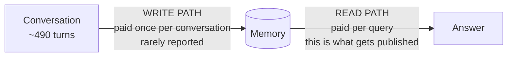
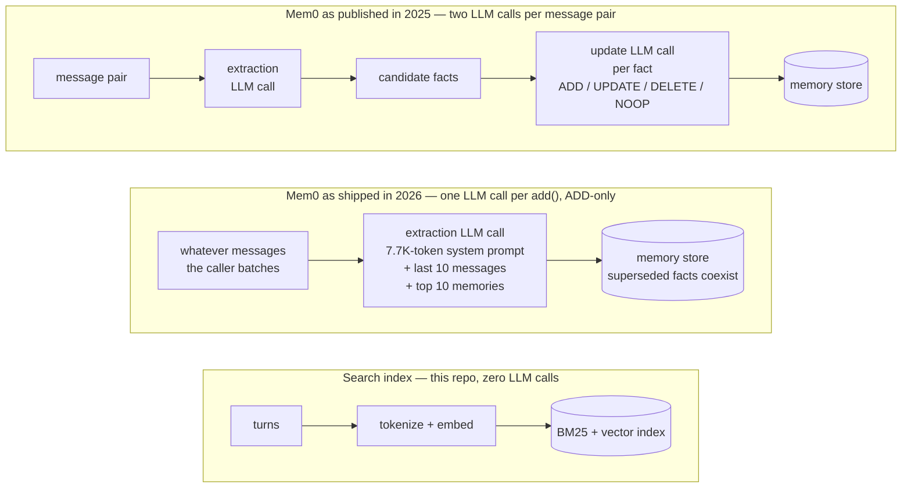
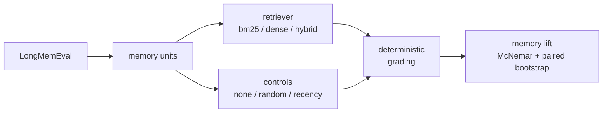

# llm-mem-eval — measuring LLM memory systems without a judge

[](https://github.com/i-shantt/llm-mem-eval/actions/workflows/tests.yml)
[](LICENSE)

An evaluation harness for long-term memory systems. It measures retrieval and
answer quality **without an LLM judge**, using LongMemEval's per-turn gold
labels, and it accounts for the cost of **building** a memory as well as the cost
of **using** it.

Built on [LongMemEval](https://arxiv.org/abs/2410.10813): 500 questions, each
with its own ~490-turn, ~104K-token conversation history.

Six instruments, each answering a question the aggregate score cannot:

| | |
|---|---|
| [benchmark audit](#what-longmemeval-actually-asks) | which questions is a retrieval metric even meaningful for? |
| [cost accounting](#the-measurement-gap) | what does the write path cost, separately from the read path? |
| [retrieval metrics](#retrieval-quality) | how good is retrieval, scored against gold labels rather than a judge? |
| [answer survival](#answer-survival-what-a-write-path-keeps) | did the write path keep the answer at all? |
| [grader audit](#grading-without-a-judge) | how often is the grader itself wrong? |
| [control ladder](#how-much-of-the-accuracy-is-actually-memory) | how much of the accuracy is memory, and how much is the model already knowing? |

**If you have five minutes:** [`scripts/audit_benchmark.py`](scripts/audit_benchmark.py)
is the most reusable finding. [`llm_mem_eval/eval/ablation.py`](llm_mem_eval/eval/ablation.py)
is the part most likely to be useful in someone else's harness.
[`RESULTS.md`](RESULTS.md) is every table, regenerated from run artifacts rather
than typed by hand. [`RUNNING.md`](RUNNING.md) is what is committed here but
deliberately **not** run.

---

## What LongMemEval actually asks

Before any number below. Every retrieval metric on this benchmark — including
this repo's — is reported as one aggregate over 500 questions. That aggregate is
only meaningful for questions whose answer is actually *present* in the turns the
benchmark labels as evidence. Measuring that is a few seconds of deterministic
work, and nobody appears to have published it
([`scripts/audit_benchmark.py`](scripts/audit_benchmark.py) →
[`results/benchmark_audit.json`](results/benchmark_audit.json)):

| question type | n | gold answer verbatim in its evidence turns |
|---|---|---|
| single-session-user | 64 | 0.906 |
| knowledge-update | 70 | 0.843 |
| single-session-assistant | 50 | 0.700 |
| **temporal-reasoning** | 118 | **0.271** |
| **multi-session** | 114 | **0.105** |

(416 of the 500 are scored here; 30 are abstention questions with no span to find
by construction, and 54 have abstractive gold answers with no checkable surface
form — the same rule `grade()` uses to return "not gradable".)

**LongMemEval-S is two benchmarks stapled together.** 184 of those 416 questions
are verbatim needle-finding. The other 232 are not: 66% of multi-session gold
answers are bare numerals — they are *counts*, computed across sessions, not
spans to be retrieved.

Restricting to golds of two or more tokens, so chance matches do not dominate,
each answer has one of three fates:

| question type | n | in labelled evidence | verbatim but unlabelled | nowhere verbatim |
|---|---|---|---|---|
| single-session-user | 42 | 0.881 | 0.000 | 0.119 |
| knowledge-update | 31 | 0.839 | 0.032 | 0.129 |
| single-session-assistant | 37 | 0.595 | 0.027 | 0.378 |
| temporal-reasoning | 99 | 0.232 | 0.152 | **0.616** |
| multi-session | 41 | 0.098 | 0.293 | **0.610** |

The third column matters: it separates *"the task needs synthesis"* from *"the
annotation is coarse"*. For the single-session types the annotation is tight —
0.000 and 0.027 of answers sit in an unlabelled turn. For the two synthesis types
about 61% of answers exist **nowhere** in 104K tokens. That is the task, not the
labelling.

Hand-classifying 20 of the temporal-reasoning misses
([`data/tr_miss_labels.json`](data/tr_miss_labels.json), regenerate with
[`scripts/sample_tr_misses.py`](scripts/sample_tr_misses.py)) says the same
thing from the other direction: 10 are date arithmetic ("38 days"), 6 are
ordering two events, 3 are paraphrase and 1 is a surface-form mismatch
("June 3rd" against "the 3rd of June"). So about a fifth of the misses would
yield to a better string matcher — a perfect one would lift temporal-reasoning to
roughly 0.39, not to the 0.88 seen on single-session-user. These are one
annotator's labels with no second rater, offered as an explanation of a measured
number rather than as validated annotation; each is checkable against the quoted
evidence in seconds.

**What follows from this, stated non-adversarially.** Mem0's managed platform
reports **97.0 (129/133) on the temporal-reasoning category at top-k 200**
([their benchmark repo](https://github.com/mem0ai/memory-benchmarks); the same
README notes those scores are the managed platform, not the open-source SDK).
This audit says 27.1% of temporal-reasoning answers are verbatim-present in their
evidence. Those two facts are perfectly compatible — and that is the point. A
high score on that category *cannot* be explained by retrieving the right span,
because for most of those questions there is no right span. Whatever produces it
is reading and computing over retrieved context, not locating an answer. So an
aggregate retrieval metric over all 500 questions mixes two tasks that behave
nothing alike, and this repo's own headline `any_hit@10` of 0.907 is subject to
exactly the same caveat.

One bookkeeping note: this audit covers all 500 questions, while the retrieval
and end-to-end arms below are a stratified n=100. They are different question
sets, so the audit bounds how those numbers should be *read*, not their values.

---

## The measurement gap

A memory system has two phases with very different economics.



The **read path** — how many tokens of retrieved context go into the prompt — is
what the field reports. Mem0's paper reports 1,764 tokens per query against
26,031 for full context ([arXiv 2504.19413](https://arxiv.org/abs/2504.19413),
Table 2). That is a real and substantial saving.

The **write path** — running an LLM over the history to extract, consolidate and
reconcile facts — is paid once per conversation, before any question is asked.
Mem0's paper does not report it. Its Section 4.5 is titled "Memory System
Overhead: Token Analysis and Construction Time", but the tokens it counts are
the *storage footprint* of the finished memory (7K per conversation), not the
tokens consumed to produce it. The only construction-cost statement in the paper
is a wall-clock one.

That is not a criticism specific to Mem0 — it is the norm. It matters because
total cost is a line, not a point:

```
total(n) = write_cost + n × read_cost_per_query
```

Reporting tokens-per-query alone is the `n → ∞` limit of that line, which
flatters whichever system spent the most up front.

This repo instruments both phases separately, so the line can be drawn.

---

## How the write cost arises

Worth being concrete, because the size of the write path follows from the
architecture.



In Mem0 as described in the 2025 paper, ingesting a message pair prompts an LLM
with a rolling conversation summary plus the last `m=10` messages and the new
pair, and that call emits a set of candidate facts. Then, *for each candidate
fact*, the top `s=10` semantically similar existing memories are retrieved and
handed back to the LLM, which picks one of **ADD**, **UPDATE**, **DELETE** or
**NOOP**. In base Mem0 there is no separate conflict-resolution classifier — the
paper is explicit that the LLM's own reasoning plays that role. `Mem0^g` differs
here: it adds entity and relationship extraction into a Neo4j graph, and does
describe a conflict-detection step with an LLM-based update resolver, which
marks superseded relationships invalid rather than deleting them.

Two points of accuracy:

- The paper describes that update step as a function/tool call; the open-source
  implementation in [`mem0/configs/prompts.py`](https://github.com/mem0ai/mem0/blob/main/mem0/configs/prompts.py)
  ships a JSON-returning prompt whose fourth operation is spelled `NONE`.
- **Mem0's current algorithm is not the 2025 paper's.** Their 2026
  [token-efficient memory algorithm](https://mem0.ai/blog/mem0-the-token-efficient-memory-algorithm)
  collapses ingestion into a *single-pass, ADD-only* extraction — UPDATE and
  DELETE are gone from the default path, and a superseded fact simply coexists
  with the one replacing it — with retrieval fusing semantic, keyword and entity
  matching in parallel. They report LongMemEval 94.4 at ~6,787 tokens per query,
  for the **managed platform**, which their benchmark README says includes
  optimisations absent from the open-source SDK.

The retrieval it moves to — lexical and semantic signals rank-fused — is the same
family as the hybrid baseline measured below. That is a point of agreement, and
it is why the comparison in this repo is between *write paths*, not retrievers.

### What one `add()` actually costs

Read at tag `v2.0.18`, the shipped ingestion path makes **one LLM call per
`add()`, regardless of how many messages that call carries**
(`mem0/memory/main.py:956`, inside `=== V3 PHASED BATCH PIPELINE ===`). The
per-fact update call is genuinely gone.

That removes the write path's dependence on the number of extracted facts, and
replaces it with a dependence on something the *caller* chooses. Three terms go
into each call, and only one of them is invariant:

| term | size | scales with |
|---|---|---|
| `ADDITIVE_EXTRACTION_PROMPT`, sent in full every call | **7,671 tokens** | number of calls |
| last 10 session messages + top 10 memories, re-sent every call | ~2,400 tokens | number of calls |
| the new messages themselves | the conversation | nothing — each turn is carried once |

So an agent that calls `add()` after every turn and a batch job that calls it
once per session run identical code and do not pay remotely the same amount.
Modelled over all 500 LongMemEval conversations
([`scripts/model_write_cost.py`](scripts/model_write_cost.py) →
[`results/write_cost_model.json`](results/write_cost_model.json)):

| `add()` batching | calls | tokens | of which system prompt | break-even vs this repo |
|---|---|---|---|---|
| per turn | 494 | 5.32M | 71% | ~15,000 queries |
| per message pair | 249 | 2.73M | 70% | ~7,900 queries |
| **per session** | 48 | 0.61M | 60% | ~1,800 queries |

**An earlier version of this section said "one extraction call per message pair
remains." That was wrong** — it described the 2025 paper, not the shipped code —
and the correction cuts both ways. Batched by session, v3 costs roughly a third
of the 1.63M tokens a competitor measured for the pre-v3 pipeline on this
benchmark. Called per message pair, it costs more than that, because the system
prompt grew from 1,137 tokens to 7,671.

Two honest qualifications. This is a **model, not a measurement** — call counts
and the prompt size are exact, but the length of a stored memory and of the
emitted JSON are assumed, and the artifact carries a sensitivity range showing
they move the total by ~9% against the 8.8× swing from batching. And that 7.7K
prefix is identical on every call, which is what prefix caching exists for; the
artifact prices both, and caching roughly halves the high-call-count rows without
changing their ordering.

---

## What the cost accounting shows


Measured on LongMemEval, n=100, turn granularity, top-10 retrieved, priced at
gpt-4o-mini prompt rates:

| | write, per conversation | read, per query |
|---|---|---|
| this repo's hybrid retriever | **$0** (no LLM calls) | $0.00032 (2,109 tok) |
| full context | $0 | $0.01562 (104,131 tok) |
| Mem0 — *reported*, LoCoMo | $0.185 (1.23M tok) | $0.00026 (1,764 tok) |

That `$0` is **API dollars, not free**. Indexing one conversation still costs
3.1 s of local compute and ~104K embedding tokens through a 33M-parameter model.
Priced at a hosted embedding rate it is on the order of $0.002 per conversation
— about 1% of the LLM-extraction figure above, so the comparison survives, but
it is a rounding-to-zero, not a zero.

Two readings, and the second is the one that matters.

**A search index with no LLM write path reads 49.4× cheaper per query than
sending the whole conversation**, and has no build cost to repay.

**Mem0's read path is genuinely cheaper per query than this repo's** — 1,764
tokens against 2,109, because extracted facts are terser than raw turns. It just
starts a build cost behind. At that rate of saving the crossover is around
**3,600 queries against a single conversation**.

That figure depends on which construction measurement you use, so all three are
shown rather than the most convenient one:

| construction source | tokens | break-even |
|---|---|---|
| RecMem Table 1, LoCoMo, gpt-4o-mini extraction | 1.23M | **~3,600 queries** |
| RecMem Table 1, LoCoMo, gpt-4.1-mini extraction | 1.52M | ~4,400 queries |
| RecMem Table 2, LongMemEval-S | 1.63M | ~4,700 queries |

The headline uses the smallest, because its extraction model matches the prices
used everywhere else here, and because quoting the largest would be picking the
number that flatters this repo.

**All three rows already assume a cheap extractor.** Every one is a small hosted
model — gpt-4o-mini or gpt-4.1-mini — not a frontier one, which matches what Mem0
OSS actually defaults to (`gpt-5-mini`, `mem0/llms/openai.py`). So "the write path
is cheap because the extraction model is cheap" is an assumption built into these
figures rather than an objection to them. The write path is not expensive because
each call is expensive; it is expensive because there are many calls, each
carrying a large fixed prompt — which is the point of the batching table above.

**What "read, per query" counts.** Retrieved context only — not the prompt
template, the date line or the question. Mem0's 1,764 is the same quantity, its
Table 2 "memory tokens" column, so the two are like-for-like. This repo's
template, date line and question add a measured **487 tokens** on top (mean
prompt 2,596 against 2,109 retrieved, `e2e_7b_hybrid_turn_k10_n100`). Two ways to
account for it, and neither changes the direction:

- Add it to **both** sides and the full-context ratio falls from 49.4× to
  **40.3×**. The break-even does not move at all, because a constant added to
  both read paths cancels in their difference.
- Charge it to this repo alone — Mem0 reports no template overhead, so its true
  per-query total is unknown and certainly above 1,764 — and the per-query saving
  widens from 345 tokens to 832, pulling the break-even in to **~1,500 queries**.

The second is the version unfavourable to this repo, which is why it is the one
worth stating: even there, a build cost still has to be repaid.

**No memory product was re-run here.** Mem0's read path comes from its own
Table 2; the construction tokens come from
[RecMem](https://arxiv.org/abs/2605.16045), a competitor measuring it, because
Mem0 publishes no such figure. The two are also measured on *different
benchmarks* — Mem0's read path on LoCoMo, this repo's on LongMemEval — so the
comparison shows the shape of the amortisation curve, not a head-to-head result.
Every quoted figure and its source lives in
[`data/published_costs.json`](data/published_costs.json).

One same-benchmark data point does exist.
[arXiv 2606.06448](https://arxiv.org/abs/2606.06448) profiled ten memory systems
on LongMemEval_S and reports, in Table 3, LLM call counts covering construction
plus 300 QA calls: **BM25 300** (one per query, no construction), **GraphRAG
3,215**, **Mem0 4,538**, **Letta 18,394**. Its Section 4.2 is titled
"Construction Dominates the Agent Lifecycle". The same table scores Mem0 at 32.0
against BM25's 47.0 — but under a different generator (Qwen3-32B) and setup than
Mem0's own paper, so read that as evidence that tuned lexical baselines are
underrated, not as a restatement of Mem0's results.

---

## Retrieval quality

Judge-free: LongMemEval labels every turn with `has_answer`, which is a gold
*retrieval* label, so these are arithmetic. n=100, turn granularity. Full tables
in [RESULTS.md](RESULTS.md).

| system | any_hit@1 | any_hit@10 | recall@10 | MRR | write ms/conv | write LLM calls |
|---|---|---|---|---|---|---|
| random | 0.021 | 0.041 | 0.021 | 0.027 | 0 | 0 |
| recency (last-N turns) | 0.000 | 0.062 | 0.028 | 0.012 | 0 | 0 |
| **BM25** | **0.546** | 0.825 | 0.693 | **0.634** | **40** | **0** |
| dense (bge-small, 33M) | 0.464 | 0.897 | **0.821** | 0.616 | 3,020 | 0 |
| hybrid (BM25 + dense, RRF) | 0.536 | **0.907** | 0.811 | 0.649 | 3,075 | 0 |
| oracle (gold evidence ranked first) | 1.000 | 1.000 | 1.000 | 1.000 | — | — |

Write cost is wall-clock, and wall-clock is machine-dependent. All six rows come
from one run on one machine with the embedding cache disabled
(`timing_is_authoritative: true` in the artifact), so the ratio between rows is
meaningful even though the absolute figures are not portable.

1. **BM25 beats a neural embedding model on top-1 precision and MRR** (0.546 vs
   0.464; 0.634 vs 0.616) for **75× less write cost**. The embedding model buys
   deeper recall and wins clearly there — `recall@10` 0.821 vs 0.693 — but it
   does not rank better. Which of the two you want depends on whether the
   answering model needs one evidence turn or all of them.
2. **BM25 is perfect on knowledge-update questions** (`any_hit@10` = 1.000, vs
   dense 0.938) — the slice the memory-conflict literature treats as the hard one.
3. **"Just keep the last N turns" does not work.** Recency scores 0.062, barely
   above random's 0.041.

The weakest slice for BM25 is `single-session-preference` (MRR 0.158),
consistent with preference questions not being lexically similar to the turns
that answer them — but that slice is **n=6**, so treat it as a hypothesis worth
testing at full scale rather than a result.

---

## Answer survival: what a write path keeps

A retriever can only find what the write path kept. Survival asks the narrowest
possible question about a store — **is the answer still in there at all?** — with
no retrieval and no generation, which makes it a ceiling on both. A store that
dropped the answer cannot be rescued by a better retriever or a bigger reader.

**Read this first: the metric runs on the easy half of the benchmark.** Its
eligible subset is the three question types whose answers are spans, which
excludes temporal-reasoning and multi-session — exactly where an extraction write
path should lose the most, and where Mem0's own extraction-model ablation shows
its largest category swing. Survival cannot measure the case that motivates it.
That is a limitation of the instrument, not a choice about what to report: you
cannot ask whether a store preserved an answer that was never text.

**And the test is biased against extraction, by construction.** "User is allergic
to peanuts" survives; "User discussed dietary restrictions" does not, even where
the second might have been enough for the reader. The `soft` variant (all gold
tokens present in one record, order ignored) narrows that gap and does not close
it, so any claim below has to hold under both. The bias is disclosed rather than
corrected, because correcting it needs a judge.

### The chance floor, which is large

Survival is measured with the same audited containment function used for
grading. At store scale that function matches by accident far more than it does
on a single prediction, so every rate is reported beside a **placebo null**:
the same test run against gold answers borrowed from other questions of the same
type and length. On the verbatim store:

| gold length | n | survival | chance null |
|---|---|---|---|
| 1 token | 74 | 1.000 | **0.661** |
| 2–3 tokens | 71 | 0.958 | 0.211 |
| 4+ tokens | 39 | 0.487 | 0.046 |

A one-token gold like `3` or `Target` is found in a 104K-token store two thirds
of the time by accident, so a rate computed over that bucket measures store size,
not memory. **The headline therefore excludes one-token golds (110 of 184
questions remain) and reports chance-corrected survival**, `(s − null) / (1 − null)`,
bootstrapped as the whole ratio rather than the numerator alone. These choices
were fixed on the control arm before any other store existed.

That containment rewards length is not a new suspicion here — [the length-decay
table below](#containment-grading-rewards-length) already showed the 14B accuracy
lead decaying to zero once answers are capped at eight words. Survival compares
~210-token turns against much shorter records, so it is the same bias with a
larger lever, which is why the budget-matched controls exist at all.

### What the controls show

Every arm here is verbatim text and calls no LLM. They differ only in how a fixed
token budget is spent: `truncate` keeps **some turns, complete**; `lead-k` keeps
**every turn, shortened** to its opening sentences. Same budget, opposite
strategy. `tail-k` is the control that says which of those two facts is doing the
work — it keeps the same number of sentences from every turn, counted from the
*end* instead of the start.

| write policy | store tokens | records | survival | null | **corrected** |
|---|---|---|---|---|---|
| verbatim (whole conversation) | 104,110 | 497 | 0.791 | 0.153 | **0.753** |
| lead-k @ 50% | 52,194 | 497 | 0.736 | 0.114 | **0.703** |
| tail-k @ 50% | 52,197 | 497 | 0.736 | 0.119 | **0.701** |
| truncate-recent @ 50% | 52,053 | 253 | 0.545 | 0.104 | **0.493** |
| tail-k @ 25% | 26,027 | 497 | 0.582 | 0.077 | **0.547** |
| lead-k @ 25% | 26,021 | 497 | 0.564 | 0.077 | **0.527** |
| truncate-random @ 25% (3 seeds) | 26,026 | ~130 | 0.309–0.391 | 0.069–0.081 | **0.248–0.342** |
| truncate-recent @ 25% | 26,026 | 128 | 0.309 | 0.063 | **0.263** |
| lead-k @ 10% | 10,410 | 411 | 0.282 | 0.047 | **0.246** |
| truncate-recent @ 10% | 10,409 | 54 | 0.182 | 0.035 | **0.152** |

Paired against the full store on the questions both scored (McNemar plus a paired
bootstrap — the same functions the memory-lift ablation uses):

| policy | survival difference vs verbatim | 95% CI | p |
|---|---|---|---|
| **lead-k @ 50%** | **−0.055** | [−0.100, −0.018] | 0.031 |
| **tail-k @ 50%** | **−0.055** | [−0.100, −0.018] | 0.031 |
| truncate-recent @ 50% | −0.245 | [−0.327, −0.164] | 1.5e-08 |
| tail-k @ 25% | −0.209 | [−0.291, −0.136] | 2.4e-07 |
| lead-k @ 25% | −0.227 | [−0.309, −0.155] | 6.0e-08 |
| truncate-recent @ 25% | −0.482 | [−0.573, −0.391] | 2.2e-16 |

The two 50% rows are identical because both arms got exactly 81 of 110 with the
same discordant pairs against verbatim (b=0, c=6) — not a copy-paste error. That
`b=0` is itself a sanity check worth stating: no truncated store ever preserves an
answer the full conversation does not, which is what "these stores are subsets"
has to mean.

Four things follow.

1. **How the budget is spent matters more than how big it is.** At an identical
   50% budget, keeping every turn's opening sentences loses 5.5 points of
   survival against the full conversation; keeping half the turns intact loses
   24.5. The gap survives the generous variant too (0.728 vs 0.560 corrected
   under `soft`), which is the test it has to pass.

   A tempting stronger claim does **not** survive it. Lead-k at 25% beats
   truncation at 50% under strict containment (0.527 vs 0.493) — better survival
   for half the tokens — but under `soft` the ordering reverses (0.541 vs 0.560).
   One budget-halving is about where the two effects cancel, so that version is
   not claimed.

2. **It is breadth that helps, not answers appearing early in a message.** Those
   two explanations predict the same lead-k number, so lead-k alone cannot
   separate them — which is what tail-k is for. Taking the *closing* sentences of
   every turn instead scores **0.701 against lead-k's 0.703** at 50%, and 0.547
   against 0.527 at 25%: indistinguishable at both budgets, on stores matched to
   within 4 tokens of each other. Meanwhile truncation at the same 50% budget
   sits at 0.493. Which sentences you keep barely matters; *how many turns you
   touch* matters a great deal.

3. **A recency prior does not help on these questions.** Truncate-recent at 25%
   (0.263) sits inside the spread of three random seeds (0.248–0.342). That
   spread — 0.094 wide, so ±0.047 about its midpoint — is the honest noise floor
   for this whole table, and the breadth-versus-depth gap at the same budget
   (0.703 against 0.493, so 0.210) is about four times it.

4. **Compression alone is expensive, but not the way a naive reading suggests.**
   Survival does not fall proportionally with budget — it falls much faster for
   deep-and-narrow stores and much slower for broad-and-shallow ones.

### What this predicts for an LLM extraction store, and why it is not measured here

An extracted memory store is broad and shallow — many short records covering the
whole conversation — which is structurally what the lead-k and tail-k arms are.
And since those two agree with each other while both beat truncation, the thing
that predicts survival at a given budget is *coverage*, not which words survive.
So this table predicts a well-behaved extraction store should sit **near the
breadth curve**, with most of its survival loss explained by being small rather
than by the LLM having rewritten anything.

That prediction is recorded before the fact deliberately, because it is the
outcome favourable to extraction-based systems. If a real extraction arm lands on
the curve, the honest conclusion is "the loss is compression, not extraction".
Only a store sitting clearly *below* the curve at its own token budget would show
the rewriting itself to be lossy.

**No LLM extraction arm was run**, so this stays a prediction. An adapter that
runs Mem0's own open-source v3 ingestion is committed at
[`llm_mem_eval/write/mem0_adapter.py`](llm_mem_eval/write/mem0_adapter.py), with a preflight
for the four ways mem0 silently degrades and a workaround for the conversation-date
contamination in [issue #3944](https://github.com/mem0ai/mem0/issues/3944).
[`RUNNING.md`](RUNNING.md) explains why it has not been run: an open 7B extractor
with a 33M-parameter embedder is a configuration Mem0 has already said in writing
is not the one their published numbers describe, and a weak result from it would
be read as evidence about their architecture rather than about that choice.

Full tables in [RESULTS.md](RESULTS.md); artifacts in
[`results/survival/`](results/survival/).

---

## Grading without a judge

Judged scores on these benchmarks move with conventions the grader is free to
pick. [arXiv 2605.24060](https://arxiv.org/abs/2605.24060) rescored LoCoMo and
LongMemEval-S under different credited targets and found the ranking changed on
**83.4–94.0% of shared queries**, with a 1,902-case semantic audit finding
relaxed credit justified only 29.2% of the time. A metric that moves that much
with an unstated choice is a poor foundation for a cost argument.

LongMemEval mostly does not need a judge anyway. The median gold answer is **11
characters** (`Target`, `$800`, `February 14th`) — short-answer QA, which had a
reproducible metric for a decade before LLM judges existed.
[`llm_mem_eval/eval/grade.py`](llm_mem_eval/eval/grade.py) scores by normalised token-span
containment: no API key, no GPU for grading, byte-identical numbers on every
re-run.

Two things make that trustworthy rather than merely cheap.

**It abstains instead of guessing.** Some gold answers are rubric paragraphs
(`"The user would prefer responses that..."`) with no checkable surface form.
`grade()` returns `None` on those and they are excluded from the denominator,
which is why n=100 reports 91 graded.

**Its error rates are measured, not assumed.**
[`scripts/audit_graders.py`](scripts/audit_graders.py) builds cases whose correct
verdict is known *by construction*: take a gold answer, substitute a different
question's gold, perturb its numbers, replace it with a refusal. No annotation
needed. Over 3,166 constructed cases:

| | rate |
|---|---|
| false accept — known-wrong answers marked correct | **0.000** |
| false reject — all meaning-preserving positives | 0.001 |
| false reject — meaning-preserving *rewrites* only | **0.003** |

CI re-measures this on every push to `main` and on every pull request, and fails
the build if the false-accept rate leaves zero, so it cannot quietly stop being
true.

**Where the audit stops being enough.** Constructed negatives are *easy*
negatives. The clearest demonstration is a false accept it could not catch: on
*"Which group did I join first, 'Page Turners' or 'Marketing Professionals'?"*
(gold `Page Turners`), the 7B hybrid arm answered that it joined *Marketing
Professionals* first, then named Page Turners later in the same answer — and
containment accepted it, because the gold string is present in a sentence
asserting the opposite. On a two-alternative question both candidates
appear in almost any answer, which makes containment nearly uninformative for
that question shape. A 0.000 false-accept rate over constructed cases is
*necessary* for trusting a grader, not *sufficient*.

**Two more, found by reading the answer key against the grader.** Neither was
reachable by the constructed audit, and they fail in opposite directions.

- The gold answer `Dr. Arati Prabhakar` was split on its period into the
  alternatives `["Dr", "Arati Prabhakar"]` — the splitter exists because
  LongMemEval spells genuine alternatives across sentences — and a bare `Dr` is
  contained in *any* answer that names *any* doctor. So
  `contains_answer("You mentioned Dr. Johnson.", "Dr. Arati Prabhakar")` returned
  **True**: naming the wrong doctor scored correct.
- The mirror error. A question whose answer *is* an ordering had its enumeration
  check disabled, leaving only contiguous-span matching, so the correct answer
  written the natural way — `"JetBlue, Delta, United, and American Airlines"` —
  was scored **wrong**, because the inserted `and` breaks the span.

Both are fixed and regression-tested. Neither moved a headline accuracy:
`regrade.py` reports 0 of 23 arms changed at full answer length. The false accept
did move exactly one published column — seven verdicts in the 15-word row of the
[length-decay table](#containment-grading-rewards-length), where truncation cuts
the name but leaves `Dr`. That is the whole argument for keeping the decay table
and the re-grade harness: a defect too small to shift an accuracy still shifted a
number, and the tooling located it precisely.

Several of the grader's known defects were found by reading real model output or
the answer key rather than by the audit, so the repo does both. Because every arm
stores its full per-question predictions,
[`scripts/regrade.py`](scripts/regrade.py) replays any grader change over all 23
stored arms and prints each changed verdict, and `tests/test_report.py` asserts
that re-grading an arm today still reproduces the accuracy stored with it — so
a grader change cannot silently desynchronise the results from the report.

---

## How much of the accuracy is actually memory?

A headline accuracy on its own says very little: a question answerable from world
knowledge, or one that leaks its answer in its own phrasing, is credited to the
memory system by default. So every arm was re-run against three controls at a
matched read-token budget — `none` (closed book), `random` (same `k`, units
chosen without reference to the query) and `recency` (just keep the last `k`
turns) — and scored against the **strongest** of them, since a system that beats
random but loses to "keep the last 10 turns" has demonstrated nothing.



| model | closed book | best control | hybrid | lift | 95% CI | attributable |
|---|---|---|---|---|---|---|
| 1.5B | 0.033 | 0.077 | 0.352 | +0.275 | [+0.165, +0.385] | 78% |
| 3B | 0.044 | 0.077 | 0.319 | +0.242 | [+0.154, +0.341] | 76% |
| 7B | 0.055 | 0.088 | 0.473 | +0.385 | [+0.275, +0.495] | 81% |
| 14B | 0.044 | 0.088 | 0.593 | +0.505 | [+0.396, +0.615] | 85% |

Exact McNemar on discordant pairs, paired bootstrap CI over 10,000 resamples;
every arm significant at **p ≤ 1.1e-05**. **76–85% of every accuracy reported
here survives its strongest control.** Closed book is flat in model size — 0.033
to 0.055 across ~9× of parameters — so essentially none of the lift is the model
already knowing the answer.

This refuted the hypothesis the controls were built to test. The expectation was
that a meaningful slice of LongMemEval would prove answerable without memory,
making reported numbers partly unearned. It is not: on both single-session types
the control scores exactly **0.000**.

Reproduce with `python scripts/run_ablation.py --results results`. With no
control arms present it refuses to report a lift and marks every system
`unattributable`.

### Memory only pays where the model can spend it

| question type | 1.5B | 3B | 7B | 14B |
|---|---|---|---|---|
| single-session-user | +0.786 | +0.429 | +0.786 | +0.786 |
| single-session-assistant | +0.500 | +0.600 | +0.700 | +0.700 |
| knowledge-update | +0.375 | +0.250 | +0.250 | +0.500 |
| multi-session | +0.077 | +0.154 | +0.231 | +0.308 |
| temporal-reasoning | +0.040 | +0.080 | +0.280 | +0.480 |

Pure lookup is saturated at 1.5B: `single-session-user` gains +0.786 from memory
on the smallest model, and 9× the parameters adds nothing. Reasoning over
retrieved evidence is the opposite — `temporal-reasoning` gains +0.040 at 1.5B,
where the model holds the dates and still cannot compare them, and +0.480 at 14B
from the *same* retrieval.

So **memory quality has a per-question-type model-capacity threshold, and below
it, better memory is wasted money.** Stated as a paired test rather than a ratio:
comparing 14B against 1.5B on the same 25 temporal-reasoning questions with
identical retrieval, 14B answers 11 that 1.5B misses and misses 2 that 1.5B
answers, p = 0.022. The gradient across all four rungs (1, 2, 7, 12 questions
gained over control) is monotonic.

A companion repo,
[llm-memory-conditioning](https://github.com/i-shantt/llm-memory-conditioning),
tested the converse — doing the date arithmetic deterministically for a small
model at render time — and **it did not hold**. It first measured +0.132
(p = 0.002) on a 100-question sample, then found it collapsed to +0.007
(p = 0.79) across all 500 questions; the sample had drawn an unusually weak
baseline. That is the clearest available warning about this repo's own sample
size.

---

## What the end-to-end run found

Retrieval quality is not answer quality, so the same 100 questions were run
through four model sizes of one family (Qwen2.5 via Ollama, `num_ctx` 8192,
greedy decoding, no judge).

| model | oracle | hybrid | bm25 |
|---|---|---|---|
| 1.5B | 0.352 | 0.352 | — |
| 3B | **0.418** | 0.319 | — |
| 7B | **0.593** | 0.473 | 0.418 |
| 14B | 0.560 | **0.593** | — |

### Oracle is not a ceiling

The oracle arm ranks the turns LongMemEval labels `has_answer` first, then pads
to the same `k=10` as every other arm with non-evidence turns in conversation
order. Questions carry **1.9 evidence turns on average** and never more than six,
so that context is mostly filler — a *different* context from a retriever's, not
a superset of one, and a smaller one on **59 of 100 questions**. So it is not an
upper bound: hybrid beat it at 14B and tied it at 1.5B.

> **Q:** Where did I redeem a $5 coupon on coffee creamer? **Gold:** `Target`
> — 14B arm
>
> **oracle**, 949 tokens: *"…The specific location is not mentioned in your
> previous conversations."*
>
> **hybrid**, 2,755 tokens: *"…it seems you redeemed the $5 coupon on coffee
> creamer at Target."*

The answer lived in a turn the benchmark never labelled as evidence. So
`1 − oracle_accuracy` is not model loss with retrieval removed; it also contains
whatever the evidence labelling missed. Any paper reporting a gold-context arm as
a ceiling is making this mistake.

**This case is not a one-off, and the benchmark audit measures how common it is.**
Over the same 184 questions the survival metric uses, the gold answer appears
verbatim somewhere in the haystack for 161 of them but inside a labelled evidence
turn for only 152 — so **9 questions (4.9%) have their answer in a turn nobody
labelled**. `Target` is one of the nine. The audit's `outside_evidence_only`
column found this by counting; the oracle arm found it by failing. Two
independent routes to the same defect, which is the reason to trust either.

### Containment grading rewards length

Answer length rises with model size (median 14 → 32 words from 1.5B to 14B), and
containment marks an answer correct if the gold span appears *anywhere* in it, so
longer answers get more chances. Re-grading the same stored answers capped at
their first N words prices that:

| arm | full | 40w | 25w | 15w | 8w |
|---|---|---|---|---|---|
| 7B hybrid | 0.473 | 0.451 | 0.374 | 0.352 | 0.253 |
| 14B hybrid | 0.593 | 0.571 | 0.462 | 0.396 | 0.253 |
| **14B − 7B** | **+0.121** | +0.121 | +0.088 | +0.044 | **+0.000** |

The 14B lead decays to exactly zero. Token-F1, which penalises length rather than
rewarding it, puts the same gap at **+0.010** — against +0.121 by containment.

So containment is fair across *retrievers at a fixed model* — same answerer, same
verbosity — and **unfair across models that differ in verbosity**. An earlier
version of this README claimed identical grading made every comparison safe. It
does not. `scripts/make_report.py` prints this decay for every arm so the caveat
cannot quietly lapse.

### Granularity has to be priced, not just measured

Retrieval units differ ~40× in size — a turn averages 211 tokens, a user turn 54,
a whole session 2,182 (`results/token_stats_*.json`, all 500 conversations).
Comparing granularities at
a shared `k` compares a 2,600-token prompt against a 22,000-token one, which is
not a comparison. Two measured symptoms:

- The `random` baseline's `recall@10` rises from **0.021 to 0.213** between turn
  and session granularity, purely because there are only ~48 sessions per example
  and a fixed `k=10` grabs a fifth of the haystack.
- Two end-to-end arms at session granularity scored 0.044 and 0.033. All 100
  prompts in each came back at exactly 4,098 tokens: they overflowed the 8,192
  window, llama.cpp discarded half the context, and the model answered "the
  excerpts don't mention it" to almost everything. **Ollama's own token counter
  could not see it**, because `prompt_eval_count` reports what the server *kept*,
  not what was sent. The backend now measures prompts before sending them, and
  the report marks any arm whose prompt lengths are all identical as `INVALID`.

Granularities are only comparable at a **matched read-token budget**, which means
a different `k` for each: ~2,600 tokens buys 12 turns, 48 user turns, or 1
session.

---

## Layout

```
llm_mem_eval/
  cost.py                    write/read cost ledger + amortisation
  data/loader.py             LongMemEval loading, turn/user_turn/session units
  retrieval/                 the READ half
    base.py                  Retriever protocol + reciprocal rank fusion
    bm25.py                  lexical baseline, zero LLM calls
    dense.py                 bge-small-en-v1.5 (33M params), local
    hybrid.py                BM25 + dense via RRF
    baselines.py             oracle, recency, random, closed-book
    embed_cache.py           disk cache that replays true compute cost
  write/                     the WRITE half: conversation -> store
    base.py                  WritePolicy protocol + store contracts
    verbatim.py              store the turns unchanged (the ceiling control)
    truncated.py             verbatim turns to a fraction of the token budget
    extractive.py            lead-k / tail-k sentences per turn: breadth, not depth
    mem0_adapter.py          Mem0 OSS v3 ingestion -- committed, NOT run
  eval/
    retrieval_metrics.py     judge-free metrics from has_answer labels
    survival.py              did the write path keep the answer? + chance floor
    grade.py                 deterministic answer grading
    grader_audit.py          grader error rates from constructed cases
    ablation.py              memory-lift attribution, McNemar, bootstrap
    judge.py                 optional LLM judge, for cross-checking only
  generate/backends.py       local answer generation (transformers / ollama)

scripts/
  audit_benchmark.py         what fraction of answers are spans at all
  sample_tr_misses.py        regenerate the hand-labelled temporal sample
  model_write_cost.py        Mem0 v3 write cost vs caller batching
  verify_write_cost_inputs.py  re-derives that model's pinned mem0 constants
  run_survival_eval.py       survival for a set of write policies
  run_retrieval_eval.py      run any set of retrievers, emit results/*.json
  run_e2e_eval.py            retrieve -> answer -> grade, with cost accounting
  run_ablation.py            memory-lift attribution against the controls
  audit_graders.py           measure grader false-accept / false-reject rates
  regrade.py                 replay a grader change over every stored arm
  measure_token_stats.py     measured token inputs for the cost figure
  make_cost_curve.py         the write+read amortisation figure
  make_report.py             regenerate RESULTS.md from run artifacts
  validate_judge.py          judge/human agreement from a labelled worksheet

tests/
  test_harness.py            label integrity + cost accounting invariants
  test_survival.py           the metric, its chance floor, its correction
  test_write_policies.py     store contracts that otherwise fail silently
  test_mem0_adapter.py       the cost shim, without needing mem0 installed
  test_ablation.py           the statistics
  test_report.py             the report agrees with the arms it reports on
```

## Reproducing

```bash
python -m venv .venv && ./.venv/bin/pip install -r requirements.txt

# ~278MB; 500 questions, each with its own ~104K-token, ~490-turn haystack
./.venv/bin/python -c "from huggingface_hub import hf_hub_download; \
  hf_hub_download('xiaowu0162/longmemeval','longmemeval_s', \
  repo_type='dataset',local_dir='data/raw')"

./.venv/bin/python -m pytest tests/ -q
./.venv/bin/python tests/test_harness.py

# benchmark audit + the v3 write-cost model: seconds, no GPU, no API key
./.venv/bin/python scripts/audit_benchmark.py
./.venv/bin/python scripts/sample_tr_misses.py
./.venv/bin/python scripts/model_write_cost.py

# answer survival: the write-path ruler and its controls (~30 min, CPU)
./.venv/bin/python scripts/run_survival_eval.py --policies \
    verbatim_turn truncated_recency_50 truncated_recency_25 \
    truncated_recency_10 truncated_recency_5 \
    truncated_random_25_s0 truncated_random_25_s1 truncated_random_25_s2 \
    leadk_50 leadk_25 leadk_10 leadk_5 tailk_50 tailk_25

# retrieval + the cost figure
./.venv/bin/python scripts/run_retrieval_eval.py --limit 100 \
    --granularity turn --tag sweep_turn_n100 \
    --retrievers random recency bm25 dense hybrid oracle
./.venv/bin/python scripts/measure_token_stats.py --limit 0 --granularity turn
./.venv/bin/python scripts/make_cost_curve.py

# grader audit, then regenerate the report
./.venv/bin/python scripts/audit_graders.py
./.venv/bin/python scripts/make_report.py > RESULTS.md
```

Retrieval runs on CPU and uses MPS or CUDA automatically if present; no API key
is needed for any retrieval result here. The end-to-end arms
(`scripts/run_e2e_eval.py`) additionally need an [Ollama](https://ollama.com)
server with the Qwen2.5 instruct models pulled, and a GPU if you would rather not
wait. The arms in `results/` were produced that way and their per-question
predictions are committed, so `regrade.py` and `run_ablation.py` reproduce every
end-to-end number here without re-running a model.

`--limit` takes a **stratified** subset preserving the question-type
distribution, so the knowledge-update and abstention slices stay intact. Every
reported number carries its own `n`.

---

## Honest limits

- **Everything here is 100 questions, and 100 questions can lie.** Each arm is a
  stratified sample, 91 of them gradable, giving roughly ±0.10 per arm near
  p = 0.5. That is wide enough to invent a large effect — the companion repo
  measured +0.132 at p = 0.002 on this same draw and watched it fall to +0.007
  across all 500 (446 gradable). The main results here are too large for that to
  explain (lift +0.242
  to +0.505 at p ≤ 1.1e-05, three to five times the sampling noise), but **every
  per-question-type row sits on n=6–26**, where one question is worth 0.04 to
  0.17, and none of those cells has been replicated at full scale. The
  `single-session-preference` slice is n=6 and should not be quoted at all.
- **No memory product was re-run here.** Every Mem0, A-Mem and RecMem figure is
  quoted from a publication, and the cost comparison mixes benchmarks — Mem0's
  read path is measured on LoCoMo, this repo's on LongMemEval. An adapter that
  runs Mem0's own OSS ingestion is committed at
  [`llm_mem_eval/write/mem0_adapter.py`](llm_mem_eval/write/mem0_adapter.py) and has
  deliberately **not** been run; [`RUNNING.md`](RUNNING.md) says why and what it
  would take.
- **The control arms bound what memory contributed *here*, not what any
  particular product would.** Running Mem0 through this same control ladder is
  the experiment I would most like to do and have not done.
- **Survival is measured on the easy half of the benchmark.** Its eligible subset
  is the three types whose answers are spans, which excludes temporal-reasoning
  and multi-session — exactly the types where an extraction write path should lose
  the most, and where Mem0's own extraction-model ablation shows the largest
  category swing. The instrument cannot measure the case that motivates it. This
  is stated at the top of the survival section too, because it is the first thing
  a reader should know about that number.
- **Survival's containment test is biased against extraction, by construction.**
  "User is allergic to peanuts" survives; "User discussed dietary restrictions"
  does not, even where the latter might have been enough for the reader. The
  `soft` variant narrows the gap and does not close it, which is why any claimed
  survival gap is required to hold under both. The direction of the bias is
  disclosed rather than corrected, because it cannot be corrected without a judge.
- **The two-alternative false accept applies to the write path too.** A record
  containing the gold string inside a sentence asserting the opposite — "not Page
  Turners, actually Chapter One" — counts as survived. It is the same defect the
  grader audit documents, relocated, and the constructed audit does not cover it
  at store scale. The placebo null bounds accidental matches; it does not bound
  this one.
- **The grader audit's 0.000 false-accept rate covers constructed negatives**,
  which are easy negatives, and the reordered-list case above was found by
  re-grading stored predictions rather than by the audit. Survival inherits that
  caveat and should not be read as inheriting a stronger guarantee than the
  grading section claims.
- **The v3 write-cost table is a model, not a measurement.** Call counts, the
  7,671-token system prompt and the content tokens are exact; the length of a
  stored memory, the emitted JSON and the template overhead are assumed. The
  artifact carries a sensitivity range — they move the total by ~9% against the
  8.8× swing from batching — but no Mem0 ingestion was actually run to check it.
- **The temporal-reasoning classification is one annotator's labels**, with no
  second rater and therefore no agreement statistic. Each label is checkable
  against the evidence quoted beside it in
  [`data/tr_miss_labels.json`](data/tr_miss_labels.json).
- **A refusal that names both candidates can be scored correct.** On
  two-alternative questions ("A or B?") the gold string appears inside answers
  that decline entirely, and containment accepts them. Three such records exist
  across the closed-book arms (14B `Page Turners`, 14B and 7B `Tom`). Because
  they land in the *control*, they inflate the control and therefore
  **understate** the reported lift — the 76–85% is conservative in this respect,
  not optimistic. An earlier version of this README asserted this class had been
  checked and cleared in the controls; that was wrong.
- **The regression tests for the two hardest grader defects are one case each.**
  `hard_list_reorder` and `reordered_ordered_list` are n=1 in the audit.
- **The deterministic grader has a known false-reject class**: gold answers whose
  surface form differs from a correct answer's (a parenthetical alias, a gold
  that is a full sentence rather than a span, a superset gold like `University of
  Melbourne in Australia`). It depresses absolute accuracy and, because the same
  rule applies to every arm, leaves within-model comparisons intact.
- **Absolute accuracies are a lower bound.** Deterministic grading is stricter
  than a human on genuine paraphrase.
- **An 8B LLM judge was tried as a cross-check and found unusable**, which is why
  `--judge-backend` exists only to characterise a judge and surface
  disagreements, never to produce a headline. That was a one-off manual labelling
  exercise and **its per-case worksheet was not retained**, so it is reported
  here as motivation rather than as a result of this repo: no artifact in
  `results/` carries a judge verdict, and every accuracy here comes from the
  deterministic grader. The reproducible claim is the 0.000 false-accept rate
  above, which CI re-measures on every push.
- `has_answer` is LongMemEval's own labelling, inheriting whatever errors it
  contains. It is a better label than an LLM judge's opinion, not a perfect one.
- **The two answer backends prompt differently.** `TransformersBackend` applies
  the model's chat template; `OllamaBackend` posts a raw prompt to
  `/api/generate`. Every reported end-to-end arm uses Ollama, so the comparisons
  here are internally consistent, but numbers are not portable between backends.
- **The `user_turn` rows are scored on 88 questions rather than 97**, because
  some questions have their evidence only in assistant turns, so that column is a
  slightly different question set.
- Retrieval quality is not answer quality. A system can retrieve the right turn
  and still answer wrong; that is what the end-to-end arm is for.

## License

[MIT](LICENSE), covering the code and the measurements in `results/`.
LongMemEval is a separate dataset under its own terms and is not redistributed
here. The *reported* figures in `data/published_costs.json` belong to the papers
each entry cites and are quoted, with attribution, for comparison.
